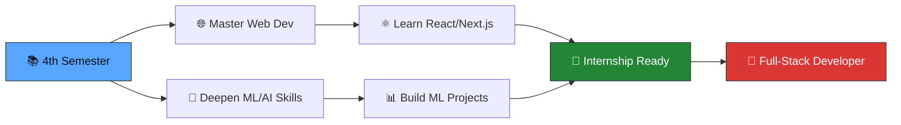

<div align="center">

<!-- Header Banner -->


<!-- Typing Animation -->
[](https://git.io/typing-svg)

</div>

---

## 🧑‍💻 About Me

```yaml
name: Qamar Abbas Mangi
role: Computer Science Student & Aspiring Software Developer
university: SIBA University
degree: BS Computer Science (4th Semester)
location: Pakistan 🇵🇰
email: qamarmangi93@gmail.com
interests:
  - Full-Stack Web Development
  - Machine Learning & Artificial Intelligence
  - Data Structures & Algorithms
  - Agile & Scrum Methodologies
  - Java Application Development
currently_working_on:
  - Web Engineering Lab Projects
  - Machine Learning Experiments
  - Building a Professional Portfolio
```


### 🎯 Quick Highlights

- 🎓 **BS Computer Science** student at **SIBA University**
- 🗳️ Built the **SIBA Voting System** — a Java-based election system with admin controls, CMS-ID verification, and department-wise result tracking
- 🤖 Currently exploring **Machine Learning** with Python, Jupyter, NumPy & Pandas
- 🌐 Learning **Web Engineering** — HTML, CSS, JavaScript
- 📋 Practiced **Agile Planning** with ZenHub, sprints, and kanban boards
- 🤝 Open to collaborating on exciting projects
- ⚡ Fun fact: I love turning complex problems into elegant solutions

<br clear="right"/>

---

## 🎓 Education

<div align="center">

| | Details |
|---|---|
| 🏛️ **University** | SIBA University |
| 📚 **Degree** | BS Computer Science |
| 📅 **Semester** | 4th Semester (Ongoing) |
| 📍 **Location** | Pakistan 🇵🇰 |

</div>

---

## 📜 Certifications & Courses

<div align="center">

| Badge | Certification | Platform | Skills Gained |
|:---:|---|---|---|
|  | **Introduction to Agile Development & Scrum** | IBM / Coursera | Agile, Scrum, ZenHub, Kanban, Sprint Planning |
|  | **Machine Learning Foundations** | Coursera | Python, Supervised & Unsupervised Learning, Data Analysis |
|  | **Data Structures & Algorithms** | SIBA University | Queues, HashMaps, Custom Data Structures, Java |
|  | **Web Engineering** | SIBA University | HTML5, CSS3, JavaScript, Responsive Design |

</div>

---

## 🛠️ Tech Stack & Tools

<div align="center">

### 💻 Languages


### 🧰 Frameworks & Libraries


### 🔧 Tools & Platforms


### 📐 Concepts & Methodologies


</div>

---

## 🚀 Featured Projects

<div align="center">

<a href="https://github.com/QamarAbbasMangi/SIBA-Voting-System-3rd-Semester-project">
  
</a>
<a href="https://github.com/QamarAbbasMangi/ML-Labs">
  
</a>

<br/><br/>

<a href="https://github.com/QamarAbbasMangi/web-labs">
  
</a>
<a href="https://github.com/QamarAbbasMangi/lab-agile-planning">
  
</a>

</div>

### 📋 Project Details

| Project | Tech Stack | Description |
|---------|-----------|-------------|
| 🗳️ [**SIBA Voting System**](https://github.com/QamarAbbasMangi/SIBA-Voting-System-3rd-Semester-project) | `Java` `DSA` `Queues` `HashMap` | Full election system for SIBA University with CMS-ID verification, department-wise voting, admin panel, winner declaration, and custom data structures |
| 🤖 [**ML Labs**](https://github.com/QamarAbbasMangi/ML-Labs) | `Python` `Jupyter` `NumPy` `Pandas` | Machine Learning lab exercises covering data preprocessing, visualization, and model training |
| 🌐 [**Web Labs**](https://github.com/QamarAbbasMangi/web-labs) | `HTML5` `CSS3` `JavaScript` | Web Engineering lab assignments showcasing front-end development skills |
| 📋 [**Agile Planning Lab**](https://github.com/QamarAbbasMangi/lab-agile-planning) | `ZenHub` `GitHub Issues` `Kanban` | Agile & Scrum methodology practice with sprint planning and user stories |

---

## 📊 GitHub Analytics

<div align="center">


<br/><br/>


</div>

---

## 🏆 GitHub Trophies

<div align="center">


</div>

---

## 📈 Contribution Graph

<div align="center">


</div>

---

## 🎯 Current Goals & Roadmap



---

## 🤝 Let's Connect

<div align="center">

[](https://github.com/QamarAbbasMangi)
[](https://www.linkedin.com/in/qamar-abbas-0b8328350/)
[](mailto:qamarmangi93@gmail.com)

<br/>

> 📫 **Feel free to reach out!** I'm always open to discussing new projects, collaborations, or opportunities.

</div>

---

<div align="center">

### 💡 *"First, solve the problem. Then, write the code."* — John Johnson

<br/>


<br/>

⭐️ **If you find my work interesting, consider giving a star!** ⭐️

</div>

<!-- Footer Wave -->

